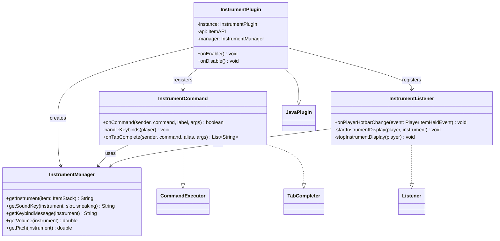

# MusicalInstruments

**A Minecraft server plugin that turns items into playable musical instruments — play live music with your hotbar.**


Built for the [TFMC](https://www.patreon.com/c/TFMCRP) roleplay server, where it runs in production for live in-game concerts and performances.

---

## What It Does

Hold an instrument in your off-hand and your hotbar becomes a keyboard: switching to slots 1–8 plays notes in real time, and holding **Shift** plays alternate notes or full chords. Each instrument is fully data-driven — server admins define instruments, sounds, volume, and pitch entirely in YAML, with no code changes required.

| | |
|---|---|
| **Live performance** | Hotbar slots 1–8 mapped to notes; instant playback with note particle effects |
| **Chord modifier** | Shift + slot plays an alternate note or chord per instrument |
| **Custom sound packs** | Integrates with TLibs, MMOItems, and ItemsAdder resource-pack sounds, plus vanilla sounds |
| **Config-driven design** | New instruments added purely through `config.yml` — items, keybinds, sounds, volume, pitch |
| **In-game help** | `/instruments keybinds` shows the note layout for whatever instrument you're holding |

## How It Works

The plugin listens for `PlayerItemHeldEvent` (hotbar slot changes). When the player has a configured instrument in their off-hand:

1. The new slot number and sneak state are resolved to a sound key via the instrument's config mapping (e.g. slot `3` + sneak → `instruments.accordion_3e_chord`).
2. The sound plays at the player's location in the `RECORDS` sound category, using the instrument's configured volume (1.0 = 16 blocks of audible range) and pitch.
3. A note particle spawns above the player, and the held slot resets to slot 9 — so the same note can be triggered repeatedly without dead inputs.

A lightweight repeating task tracks each performing player and cleans itself up the moment the instrument leaves their off-hand, keeping the scheduler free of stale tasks.

## Architecture

Small, deliberate footprint — each class has one job:

```
src/main/java/tfmc/justin/
├── InstrumentPlugin.java              # Entry point: wiring, lifecycle, config loading
├── commands/
│   └── InstrumentCommand.java         # /instruments command + tab completion
├── listeners/
│   └── InstrumentListener.java        # Hotbar-change → sound playback pipeline
└── managers/
    └── InstrumentManager.java         # Config-backed instrument/sound resolution
```



*Full diagram: [UML-Diagram.mmd](UML-Diagram.mmd)*

### Design decisions

- **Configuration over code** — instruments are pure data. Adding a new instrument (item, note layout, chords, volume) is a YAML edit, not a release.
- **Event-driven, zero polling for input** — playback rides on Bukkit's own hotbar event; the only scheduled task is a 1-second-interval watcher per *active* performer, cancelled as soon as they stow the instrument.
- **Abstraction over item plugins** — item identity resolves through the TLibs `ItemAPI`, so the same config format supports MMOItems, ItemsAdder, and vanilla items with a one-character prefix.

## Installation

1. Drop `musicalinstruments-2.0.jar` into your server's `plugins/` folder
2. Install **TLibs** (required). **MMOItems** / **ItemsAdder** are optional sound-pack sources
3. Restart the server (or load with PlugManX)
4. Define your instruments in `plugins/MusicalInstruments/config.yml`

### Requirements

| Dependency | Required |
|---|---|
| [Paper](https://papermc.io/) 1.21+ | Yes |
| Java 21 | Yes |
| [TLibs](https://www.spigotmc.org/resources/tlibs.127713/) | Yes |
| [MMOItems](https://www.spigotmc.org/resources/mmoitems-premium.39267/) | Optional |
| [ItemsAdder](https://itemsadder.com/) | Optional |

## Usage

1. Hold an instrument item in your **off-hand**
2. Switch between hotbar slots **1–8** to play notes
3. Hold **Shift** while switching to play chords / alternate notes
4. Run `/instruments keybinds` to see your instrument's note layout

| Command | Description |
|---|---|
| `/instruments keybinds` | Show the keybind layout for the instrument in your off-hand |

## Configuration

Each instrument is one self-contained section in `config.yml`:

```yaml
accordion:
  # Item that acts as the instrument (TLibs/MMOItems/ItemsAdder/vanilla path)
  item: "m.instruments.accordion"

  # Message shown by /instruments keybinds
  keybind-message: |
   §aUse keys 1-8 to play §6notes:
   §e1-[C] 2-[D] 3-[E] 4-[F] 5-[G] 6-[A] 7-[B] 8-[C]

   §aHold shift to play §6chords:
   §e1-[C] 2-[D] 3-[E] 4-[F] 5-[G] 6-[A] 7-[B] 8-[C]

  # Hotbar slot → sound key (plus shift variants)
  hotbar-sounds:
    1: instruments.accordion_1c_single
    1+sneak: instruments.accordion_1c_chord
    2: instruments.accordion_2d_single
    2+sneak: instruments.accordion_2d_chord
    # ... slots 3-8 follow the same pattern

  volume: 4.0   # 1.0 = 16 blocks of range (4.0 = 64 blocks)
  pitch: 1.0    # 0.5 (lower/slower) to 2.0 (higher/faster)
```

**Item path formats**

| Source | Format | Example |
|---|---|---|
| MMOItems | `m.category.item_id` | `m.instruments.accordion` |
| ItemsAdder | `ia.namespace:item_id` | `ia.tfmc:accordion` |
| Vanilla | `v.material` | `v.iron_ingot` |

## Building from Source

```bash
git clone https://github.com/JustinasLa/musical-instruments.git
cd musical-instruments
mvn package
```

Requires JDK 21 and Maven. The TLibs and MMOItems jars are referenced as local system dependencies — adjust the paths in `pom.xml` to your local copies. The built jar is copied to the project root by the `package` phase.

## Tech Stack

- **Java 21** · **Paper API 1.21.3** · **Maven**
- Bukkit event system, scheduler, and YAML configuration API
- TLibs ItemAPI for cross-plugin item resolution

## Author

**Justinas Launikonis** — plugin developer for TFMC
[GitHub](https://github.com/JustinasLa) · [Support TFMC](https://www.patreon.com/c/TFMCRP)
