# Musical Instruments

A Minecraft Paper plugin that adds playable musical instruments with custom sounds, a recording system, and the ability to share musical compositions between players.

## Features

- **Playable Instruments**: Hold instruments in your off-hand and play notes using hotbar slots 1-8
- **Custom Sound Support**: Works with custom sounds via TLibs/MMOItems/ItemsAdder and vanilla Minecraft sounds
- **Shift Modifier**: Hold shift while selecting hotbar slots to play different notes or chords
- **Recording System**: Create, edit, and save musical recordings with a GUI editor
- **Timing Control**: Set custom delays between note rows for rhythm control
- **Recording Metadata**: Add names, authors, and descriptions to your recordings
- **Sharing System**: Share recordings with other players using "Bard's Notation" scrolls
- **Playback Items**: Convert recordings into consumable music disc items
- **Access Control**: Recordings track ownership and can be shared selectively
- **Preview System**: Preview sounds before adding them to your recording

## Architecture

The plugin follows a modular architecture with clear separation between managers, menus, listeners, and commands:

```mermaid
classDiagram
    %% Main Plugin Class
    class InstrumentPlugin {
        -instance: InstrumentPlugin
        -api: ItemAPI
        -manager: InstrumentManager
        -recordingsManager: RecordingsManager
        -recordingsMenu: RecordingsMenu
        -recordingCreationMenu: RecordingCreationMenu
        -instrumentSelectionMenu: InstrumentSelectionMenu
        -soundSelectionMenu: SoundSelectionMenu
        -delayInputListener: DelayInputListener
        -recordingMetadataMenu: RecordingMetadataMenu
        -metadataInputListener: MetadataInputListener
        -recordingOptionsMenu: RecordingOptionsMenu
        -recordingCopyListener: RecordingCopyListener
        -recordingsPluginConfig: FileConfiguration
        +onEnable() void
        +onDisable() void
        +getInstance() InstrumentPlugin
        +getApi() ItemAPI
        +getManager() InstrumentManager
        +getRecordingsManager() RecordingsManager
        +getRecordingsMenu() RecordingsMenu
    }

    %% Managers Package
    class InstrumentManager {
        -plugin: InstrumentPlugin
        -api: ItemAPI
        +InstrumentManager(plugin, api)
        +getInstrument(item: ItemStack) String
        +getSoundKey(instrument: String, slot: int, sneaking: boolean) String
        +getKeybindMessage(instrument: String) String
        +getVolume(instrument: String) double
        +getPitch(instrument: String) double
        +getAllInstruments() Set~String~
        +getInstrumentItem(instrument: String) ItemStack
    }

    class RecordingsManager {
        -plugin: InstrumentPlugin
        -recordingsFile: File
        -recordingsConfig: FileConfiguration
        +RecordingsManager(plugin)
        -loadRecordingsConfig() void
        +saveRecordings() void
        +reloadRecordings() void
        +getAllRecordingIds() Set~String~
        +getRecordingName(id: String) String
        +getRecordingCreator(id: String) String
        +getRecordingAuthor(id: String) String
        +getRecordingDescription(id: String) String
        +getRecordingDate(id: String) String
        +getRecordingInstrument(id: String) String
        +createNewRecording() String
        +createNewRecording(instrument: String) String
        +getSavedSlots(id: String) Map
        +getSavedRowDelays(id: String) Map
        +getAccessibleRecordingIds(playerId: UUID) Set~String~
    }

    %% Commands Package
    class InstrumentCommand {
        -plugin: InstrumentPlugin
        -manager: InstrumentManager
        +InstrumentCommand(plugin, manager)
        +onCommand(sender, command, label, args) boolean
        -handleKeybinds(player: Player) void
        -handleRecordings(player: Player, args: String[]) void
        +onTabComplete(sender, command, alias, args) List~String~
    }

    %% Listeners Package
    class InstrumentListener {
        -plugin: InstrumentPlugin
        -manager: InstrumentManager
        -instrumentTasks: Map~Player,Integer~
        +InstrumentListener(plugin, manager)
        +onPlayerHotbarChange(event: PlayerItemHeldEvent) void
        -startInstrumentDisplay(player: Player, instrument: String) void
        -stopInstrumentDisplay(player: Player) void
    }

    class MenuListener {
        -plugin: InstrumentPlugin
        -recordingsManager: RecordingsManager
        -recordingsMenu: RecordingsMenu
        -recordingCreationMenu: RecordingCreationMenu
        -instrumentSelectionMenu: InstrumentSelectionMenu
        -soundSelectionMenu: SoundSelectionMenu
        -delayInputListener: DelayInputListener
        -recordingMetadataMenu: RecordingMetadataMenu
        -metadataInputListener: MetadataInputListener
        -recordingOptionsMenu: RecordingOptionsMenu
        +MenuListener(plugin, managers, menus)
        +onInventoryClick(event: InventoryClickEvent) void
        -handleRecordingsMenuClick(player: Player, slot: int) void
        -handleRecordingCreationMenuClick(player, slot, event) void
        -handleInstrumentSelectionClick(player: Player, slot: int) void
        -handleSoundSelectionClick(player, slot, event) void
        -handleMetadataMenuClick(player: Player, slot: int) void
        -handleRecordingOptionsClick(player: Player, slot: int) void
    }

    class DelayInputListener {
        -plugin: InstrumentPlugin
        -recordingCreationMenu: RecordingCreationMenu
        -awaitingDelayInput: Map~UUID,Integer~
        +DelayInputListener(plugin, menu)
        +onPlayerChat(event: AsyncPlayerChatEvent) void
        +requestDelayInput(player: Player, rowNumber: int) void
        +isAwaitingInput(player: Player) boolean
    }

    class MetadataInputListener {
        -plugin: InstrumentPlugin
        -metadataMenu: RecordingMetadataMenu
        -awaitingMetadataInput: Map~UUID,String~
        +MetadataInputListener(plugin, menu)
        +onPlayerChat(event: AsyncPlayerChatEvent) void
        +requestMetadataInput(player: Player, fieldType: String) void
        +isAwaitingInput(player: Player) boolean
    }

    class RecordingCopyListener {
        -plugin: InstrumentPlugin
        +RECORDING_ID_KEY: String
        +SHARE_SCROLL_KEY: String
        +RecordingCopyListener(plugin)
        +getRecordingIdKey() NamespacedKey
        +getShareScrollKey() NamespacedKey
        +createCopyItem(recordingId: String) ItemStack
        +createShareScroll(recordingId: String) ItemStack
        +onPlayerInteract(event: PlayerInteractEvent) void
    }

    %% Menu Package
    class RecordingsMenu {
        -plugin: InstrumentPlugin
        -recordingsManager: RecordingsManager
        -playerSlotMap: Map~UUID,Map~
        +MENU_TITLE: String
        +CREATE_BUTTON_SLOT: int
        +RecordingsMenu(plugin, manager)
        +openMenu(player: Player) void
        -createRecordingItem(id: String, player: Player) ItemStack
        -createNewRecordingButton() ItemStack
        +getRecordingIdFromSlot(player: Player, slot: int) String
        +isOwnerSlot(player: Player, slot: int) boolean
    }

    class RecordingCreationMenu {
        -plugin: InstrumentPlugin
        -playerPages: Map~UUID,Integer~
        -playerRowDelays: Map~UUID,Map~
        -playerSlotSounds: Map~UUID,Map~
        -playerEditingId: Map~UUID,String~
        +MENU_TITLE: String
        +PREV_PAGE_SLOT: int
        +PREVIEW_SLOT: int
        +SAVE_SLOT: int
        +PAGE_INFO_SLOT: int
        +CANCEL_SLOT: int
        +NEXT_PAGE_SLOT: int
        +RecordingCreationMenu(plugin)
        +loadRecordingForEditing(player: Player, recordingId: String) void
        +openMenu(player: Player) void
        +openMenu(player: Player, page: int) void
        +setAssignedSound(player, slot, sound) void
        +getAssignedSound(player, slot) AssignedSound
        +setRowDelay(player, row, delay) void
        +getRowDelay(player, row) Double
        +clearPlayerData(player: Player) void
    }

    class InstrumentSelectionMenu {
        -plugin: InstrumentPlugin
        -instrumentManager: InstrumentManager
        -playerTargetSlots: Map~UUID,Integer~
        -playerSlotToVanillaCategory: Map~UUID,Map~
        +MENU_TITLE: String
        +BACK_BUTTON_SLOT: int
        +InstrumentSelectionMenu(plugin, manager)
        +openMenu(player: Player, targetSlot: int) void
        -createInstrumentMenuItem(instrumentId: String) ItemStack
        -createVanillaCategoryItem(category: VanillaSoundCategory) ItemStack
        +getTargetSlot(player: Player) Integer
        +isVanillaCategory(player, slot) boolean
        +getVanillaCategory(player, slot) String
    }

    class SoundSelectionMenu {
        -plugin: InstrumentPlugin
        -instrumentManager: InstrumentManager
        -playerTargetSlots: Map~UUID,Integer~
        -playerSelectedInstruments: Map~UUID,String~
        -playerSelectedSounds: Map~UUID,String~
        -playerSelectedVanillaCategory: Map~UUID,VanillaSoundCategory~
        -playerCurrentPage: Map~UUID,Integer~
        -playerCurrentlyPlayingSound: Map~UUID,String~
        +MENU_TITLE_PREFIX: String
        +BACK_BUTTON_SLOT: int
        +PREVIOUS_PAGE_SLOT: int
        +PAGE_INFO_SLOT: int
        +NEXT_PAGE_SLOT: int
        +ADD_BUTTON_SLOT: int
        +SoundSelectionMenu(plugin, manager)
        +openMenu(player, instrumentId, targetSlot) void
        +openMenuForVanillaCategory(player, category, targetSlot) void
        -openSoundMenu(player, sounds, displayName) void
        -getSoundsForInstrument(instrumentId: String) List~String~
        +getTargetSlot(player: Player) Integer
        +getSelectedSound(player: Player) String
        +getSelectedInstrument(player: Player) String
        +getSelectedVanillaCategory(player: Player) VanillaSoundCategory
    }

    class RecordingMetadataMenu {
        -plugin: InstrumentPlugin
        -playerRecordingName: Map~UUID,String~
        -playerRecordingAuthor: Map~UUID,String~
        -playerRecordingDescription: Map~UUID,String~
        +MENU_TITLE: String
        +NAME_SLOT: int
        +AUTHOR_SLOT: int
        +DESCRIPTION_SLOT: int
        +SAVE_SLOT: int
        +CANCEL_SLOT: int
        +RecordingMetadataMenu(plugin)
        +openMenu(player: Player) void
        -createMetadataItem(player, type) ItemStack
        -createSaveButton(player: Player) ItemStack
        -createCancelButton() ItemStack
        +setRecordingName(player, name) void
        +setAuthor(player, author) void
        +setDescription(player, description) void
        +getRecordingName(player: Player) String
        +getAuthor(player: Player) String
        +getDescription(player: Player) String
        +clearMetadata(player: Player) void
    }

    class RecordingOptionsMenu {
        -plugin: InstrumentPlugin
        -playerRecordingId: Map~UUID,String~
        +MENU_TITLE: String
        +DELETE_SLOT: int
        +EDIT_SLOT: int
        +COPY_SLOT: int
        +SHARE_SLOT: int
        +BACK_SLOT: int
        +OTHER_COPY_SLOT: int
        +RecordingOptionsMenu(plugin)
        +openMenu(player: Player, recordingId: String) void
        +openMenuForOther(player: Player, recordingId: String) void
        -createOption(material, name, lore) ItemStack
        +getRecordingId(player: Player) String
        +cleanup(player: Player) void
    }

    %% Data/Model Classes
    class AssignedSound {
        -instrumentId: String
        -category: VanillaSoundCategory
        -soundName: String
        +AssignedSound(instrumentId, soundName)
        +AssignedSound(category, soundName)
        +isVanilla() boolean
        +getInstrumentId() String
        +getCategory() VanillaSoundCategory
        +getSoundName() String
        +getSourceDisplayName() String
    }

    class VanillaSoundCategory {
        <<enumeration>>
        NOTE_BLOCKS
        BLOCKS
        MUSIC
        ENTITIES
        AMBIENT
        UI
        OTHER
        -name: String
        -icon: Material
        -displayName: String
        +getName() String
        +getIcon() Material
        +getDisplayName() String
        +getSounds() List~String~
    }

    %% Bukkit Framework Classes (external)
    class JavaPlugin {
        <<Bukkit>>
    }

    class Listener {
        <<Bukkit>>
    }

    class CommandExecutor {
        <<interface>>
        <<Bukkit>>
    }

    class TabCompleter {
        <<interface>>
        <<Bukkit>>
    }

    %% Relationships
    InstrumentPlugin --|> JavaPlugin
    InstrumentPlugin --> InstrumentManager : manages
    InstrumentPlugin --> RecordingsManager : manages
    InstrumentPlugin --> InstrumentCommand : registers
    InstrumentPlugin --> InstrumentListener : registers
    InstrumentPlugin --> MenuListener : registers
    InstrumentPlugin --> DelayInputListener : registers
    InstrumentPlugin --> MetadataInputListener : registers
    InstrumentPlugin --> RecordingCopyListener : registers
    InstrumentPlugin --> RecordingsMenu : creates
    InstrumentPlugin --> RecordingCreationMenu : creates
    InstrumentPlugin --> InstrumentSelectionMenu : creates
    InstrumentPlugin --> SoundSelectionMenu : creates
    InstrumentPlugin --> RecordingMetadataMenu : creates
    InstrumentPlugin --> RecordingOptionsMenu : creates

    InstrumentManager --> InstrumentPlugin : uses
    RecordingsManager --> InstrumentPlugin : uses

    InstrumentCommand ..|> CommandExecutor
    InstrumentCommand ..|> TabCompleter
    InstrumentCommand --> InstrumentPlugin : uses
    InstrumentCommand --> InstrumentManager : uses

    InstrumentListener ..|> Listener
    InstrumentListener --> InstrumentPlugin : uses
    InstrumentListener --> InstrumentManager : uses

    MenuListener ..|> Listener
    MenuListener --> InstrumentPlugin : uses
    MenuListener --> RecordingsManager : uses
    MenuListener --> RecordingsMenu : uses
    MenuListener --> RecordingCreationMenu : uses
    MenuListener --> InstrumentSelectionMenu : uses
    MenuListener --> SoundSelectionMenu : uses
    MenuListener --> DelayInputListener : uses
    MenuListener --> RecordingMetadataMenu : uses
    MenuListener --> MetadataInputListener : uses
    MenuListener --> RecordingOptionsMenu : uses

    DelayInputListener ..|> Listener
    DelayInputListener --> InstrumentPlugin : uses
    DelayInputListener --> RecordingCreationMenu : uses

    MetadataInputListener ..|> Listener
    MetadataInputListener --> InstrumentPlugin : uses
    MetadataInputListener --> RecordingMetadataMenu : uses

    RecordingCopyListener ..|> Listener
    RecordingCopyListener --> InstrumentPlugin : uses

    RecordingsMenu --> InstrumentPlugin : uses
    RecordingsMenu --> RecordingsManager : uses

    RecordingCreationMenu --> InstrumentPlugin : uses
    RecordingCreationMenu --> AssignedSound : manages

    InstrumentSelectionMenu --> InstrumentPlugin : uses
    InstrumentSelectionMenu --> InstrumentManager : uses
    InstrumentSelectionMenu --> VanillaSoundCategory : uses

    SoundSelectionMenu --> InstrumentPlugin : uses
    SoundSelectionMenu --> InstrumentManager : uses
    SoundSelectionMenu --> VanillaSoundCategory : uses

    RecordingMetadataMenu --> InstrumentPlugin : uses

    RecordingOptionsMenu --> InstrumentPlugin : uses

    AssignedSound --> VanillaSoundCategory : contains
```



*View the [UML source file](UML-Diagram.mmd) for editing*

## Dependencies

| Dependency | Required |
|---|---|
| [Paper](https://papermc.io/) 1.21+ | Yes |
| [TLibs](https://www.spigotmc.org/resources/tlibs.127713/) | Yes |
| [MMOItems](https://www.spigotmc.org/resources/mmoitems-premium.39267/) | No |
| [ItemsAdder](https://itemsadder.com/) | No |

## Installation

1. Place `MusicalInstruments.jar` into your server's `plugins/` folder
2. Make sure that **TLibs** is also installed. **MMOItems** and **ItemsAdder** are optional
3. Reload the server or Enable the plugin with PlugManX
4. Configure `plugins/MusicalInstruments/config.yml` to define your instruments
5. Optionally configure `plugins/MusicalInstruments/recordingsConfig.yml` for recording settings

## Usage

### Playing Instruments

1. Hold an instrument item in your **off-hand** (left hand)
2. Switch between hotbar slots 1-8 to play different notes
3. Hold **Shift** while switching slots to play alternative notes or chords
4. Use `/instruments keybinds` to see the keybind layout for your current instrument

### Creating Recordings

1. Run `/instruments recordings` to open the recordings menu
2. Click **"Create New Recording"** to start the editor
3. Click empty slots to add sounds (choose from instruments or vanilla sounds)
4. Click the paper icon next to each row to set timing delays
5. Use the **Preview** button to test your recording
6. Click **Save** and fill in the metadata (name, author, description)
7. Your recording is saved and can be shared or played back

### Sharing Recordings

1. Open `/instruments recordings` and click on one of your recordings
2. Click the **"Share"** option to receive a "Bard's Notation" scroll
3. Give the scroll to another player
4. They can right-click the scroll to receive a playable copy of your recording

### Playing Recording Copies

1. Right-click a music disc recording item to play it
2. The recording will play once and the item will be consumed
3. All nearby players will hear the recording

## Configuration

### Main Configuration (`config.yml`)

Each instrument is defined with its own section:

```yaml
accordion:
  # Item path from TLibs/MMOItems/ItemsAdder
  item: "m.instruments.accordion"

  # Keybind message shown with /instruments keybinds
  keybind-message: |
   §aUse keys 1-8 to play §6notes:
   §e1-[C] 2-[D] 3-[E] 4-[F] 5-[G] 6-[A] 7-[B] 8-[C]
   
   §aHold shift to play §6chords:
   §e1-[C] 2-[D] 3-[E] 4-[F] 5-[G] 6-[A] 7-[B] 8-[C]

  # Sound mappings for each hotbar slot
  hotbar-sounds:
    1: instruments.accordion_1c_single
    1+sneak: instruments.accordion_1c_chord
    2: instruments.accordion_2d_single
    2+sneak: instruments.accordion_2d_chord
    3: instruments.accordion_3e_single
    3+sneak: instruments.accordion_3e_chord
    4: instruments.accordion_4f_single
    4+sneak: instruments.accordion_4f_chord
    5: instruments.accordion_5g_single
    5+sneak: instruments.accordion_5g_chord
    6: instruments.accordion_6a_single
    6+sneak: instruments.accordion_6a_chord
    7: instruments.accordion_7b_single
    7+sneak: instruments.accordion_7b_chord
    8: instruments.accordion_8c_single
    8+sneak: instruments.accordion_8c_chord

  # Sound settings
  volume: 4.0   # 1 Volume = 16 blocks of range (4.0 = 64 blocks)
  pitch: 1.0    # Range: 0.5 (slower) to 2.0 (faster)

# Add more instruments following the same pattern
celtic_harp:
  item: "m.instruments.celtic_harp"
  keybind-message: |
   §aUse keys 1-8 to play §6notes:
   §e1-[C] 2-[D] 3-[E] 4-[F] 5-[G] 6-[A] 7-[B] 8-[C]
  hotbar-sounds:
    1: instruments.celtic_harp_1c_single
    # ... define all 8 slots + shift variants
  volume: 4.0
  pitch: 1.0
```

### Item Path Formats

- **MMOItems**: `m.category.item_id` (e.g., `m.instruments.accordion`)
- **ItemsAdder**: `ia.namespace:item_id` (e.g., `ia.tfmc:accordion`)
- **Vanilla**: `v.material` (e.g., `v.iron_ingot`)

### Recordings Configuration (`recordingsConfig.yml`)

```yaml
permissions:
  # Permission required to run /instruments recordings access <recording_id>
  # Gives a Bard's Notation (share scroll) for the specified recording
  recordings-access: "musicalinstruments.recordings.access"

playback:
  volume: 4.0   # Volume for recording playback (1 = 16 blocks range)
  pitch: 1.0    # Pitch for recording playback (0.5-2.0)
```

## Commands

| Command | Description | Permission |
|---|---|---|
| `/instruments keybinds` | Display keybinds for the instrument in your off-hand | Default |
| `/instruments recordings` | Open the recordings management GUI | Default |
| `/instruments recordings access <id>` | Get a share scroll for a recording (admin) | `musicalinstruments.recordings.access` |

## Permissions

| Permission | Description | Default |
|---|---|---|
| `musicalinstruments.recordings.access` | Access the recordings admin command | OP |

## Data Storage

- **Recordings**: Stored in `plugins/MusicalInstruments/recordings.yml`
- Each recording includes:
  - Unique ID and creation timestamp
  - Metadata (name, author, description, creator UUID)
  - Sound slots with instrument/sound mappings
  - Row timing delays for playback
  - Access control list

## Technical Details

### Sound Assignment

Recordings track both the **sound** (`instruments.accordion_1c_single`) and its **source**:
- **Custom instruments**: Source is the instrument ID (e.g., `accordion`)
- **Vanilla sounds**: Source is the category (e.g., `NOTE_BLOCKS`, `BLOCKS`)

This allows recordings to be portable across different sound packs.

### Timing System

- Recordings are organized into **rows** (slots 0-8, 9-17, 18-26, etc.)
- Each row can have a custom **delay** (0-10 seconds)
- During playback, all sounds in a row play simultaneously
- The system waits for the row's delay before playing the next row
- Default delay is 0.1 seconds (instant progression)

### Access Control

- Recordings store the **creator's UUID**
- Players can only edit/delete their own recordings
- Share scrolls allow safe distribution without giving edit access
- Admin command allows generating shares for any recording

## Author

Justin - TFMC
[Donation Link](https://www.patreon.com/c/TFMCRP)