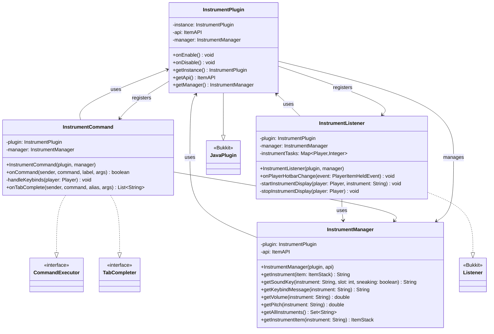

# Musical Instruments

A Minecraft Paper plugin that adds playable musical instruments with custom sounds.

## Features

- **Playable Instruments**: Hold instruments in your off-hand and play notes using hotbar slots 1-8
- **Custom Sound Support**: Works with custom sounds via TLibs/MMOItems/ItemsAdder and vanilla Minecraft sounds
- **Shift Modifier**: Hold shift while selecting hotbar slots to play different notes or chords

## Architecture

The plugin follows a modular architecture with clear separation between managers, listeners, and commands:



*View the [UML source file](UML-Diagram.mmd) for editing*

## Dependencies

| Dependency | Required |
|---|---|
| [Paper](https://papermc.io/) 1.21+ | Yes |
| [TLibs](https://www.spigotmc.org/resources/tlibs.127713/) | Yes |
| [MMOItems](https://www.spigotmc.org/resources/mmoitems-premium.39267/) | No |
| [ItemsAdder](https://itemsadder.com/) | No |

## Installation

1. Place `MusicalInstruments.jar` into your server's `plugins/` folder
2. Make sure that **TLibs** is also installed. **MMOItems** and **ItemsAdder** are optional
3. Reload the server or Enable the plugin with PlugManX
4. Configure `plugins/MusicalInstruments/config.yml` to define your instruments

## Usage

### Playing Instruments

1. Hold an instrument item in your **off-hand** (left hand)
2. Switch between hotbar slots 1-8 to play different notes
3. Hold **Shift** while switching slots to play alternative notes or chords
4. Use `/instruments keybinds` to see the keybind layout for your current instrument

## Configuration

### Main Configuration (`config.yml`)

Each instrument is defined with its own section:

```yaml
accordion:
  # Item path from TLibs/MMOItems/ItemsAdder
  item: "m.instruments.accordion"

  # Keybind message shown with /instruments keybinds
  keybind-message: |
   §aUse keys 1-8 to play §6notes:
   §e1-[C] 2-[D] 3-[E] 4-[F] 5-[G] 6-[A] 7-[B] 8-[C]
   
   §aHold shift to play §6chords:
   §e1-[C] 2-[D] 3-[E] 4-[F] 5-[G] 6-[A] 7-[B] 8-[C]

  # Sound mappings for each hotbar slot
  hotbar-sounds:
    1: instruments.accordion_1c_single
    1+sneak: instruments.accordion_1c_chord
    2: instruments.accordion_2d_single
    2+sneak: instruments.accordion_2d_chord
    3: instruments.accordion_3e_single
    3+sneak: instruments.accordion_3e_chord
    4: instruments.accordion_4f_single
    4+sneak: instruments.accordion_4f_chord
    5: instruments.accordion_5g_single
    5+sneak: instruments.accordion_5g_chord
    6: instruments.accordion_6a_single
    6+sneak: instruments.accordion_6a_chord
    7: instruments.accordion_7b_single
    7+sneak: instruments.accordion_7b_chord
    8: instruments.accordion_8c_single
    8+sneak: instruments.accordion_8c_chord

  # Sound settings
  volume: 4.0   # 1 Volume = 16 blocks of range (4.0 = 64 blocks)
  pitch: 1.0    # Range: 0.5 (slower) to 2.0 (faster)

# Add more instruments following the same pattern
celtic_harp:
  item: "m.instruments.celtic_harp"
  keybind-message: |
   §aUse keys 1-8 to play §6notes:
   §e1-[C] 2-[D] 3-[E] 4-[F] 5-[G] 6-[A] 7-[B] 8-[C]
  hotbar-sounds:
    1: instruments.celtic_harp_1c_single
    # ... define all 8 slots + shift variants
  volume: 4.0
  pitch: 1.0
```

### Item Path Formats

- **MMOItems**: `m.category.item_id` (e.g., `m.instruments.accordion`)
- **ItemsAdder**: `ia.namespace:item_id` (e.g., `ia.tfmc:accordion`)
- **Vanilla**: `v.material` (e.g., `v.iron_ingot`)

## Commands

| Command | Description | Permission |
|---|---|---|
| `/instruments keybinds` | Display keybinds for the instrument in your off-hand | Default |

## Author

Justin - TFMC
[Donation Link](https://www.patreon.com/c/TFMCRP)
